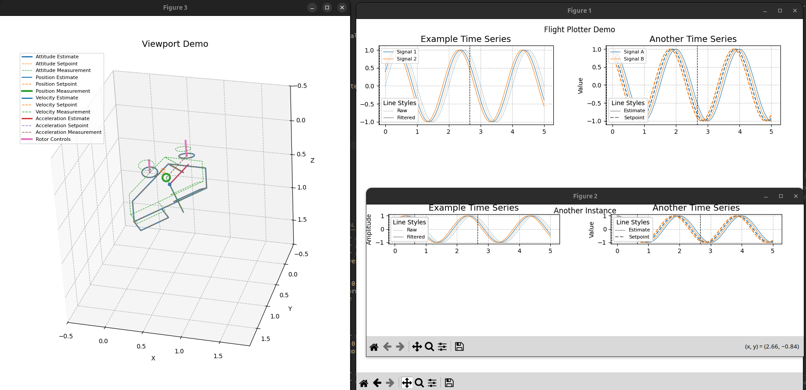
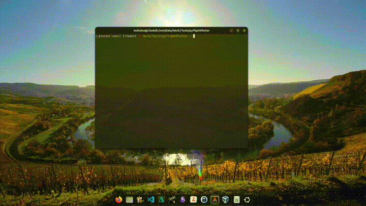

# pyFlightPlotter
Interactive, configurable and three-dimensional flight data plotting, with little boilerplate

<!--  -->


Features:
- [x] 3D plotting including estimation, setpoint and measurements of
  - attitude
  - position
  - velocity
  - acceleration
  - rotor force command
  - control surface deflection
- [x] Time-series plotting in configurable window
  - `_plot_timeseries()` method supports different line styles and colours, yet keeps style consistent
- [x] Syncronized vertical cursor in time-series; even 3D window updates with mouse hover
- [x] Craft3D class with `addRotor` and `addSurface` methods to vastly simplify building crafts
  - Single-axis surface tilt supported
  - Dual-axis rotor tilt supported 
- [x] Real-time animation (although currently relatively low frame-rate, unless only drawing attitude)
- [ ] automatic playback (instead of mouse hover)
- [ ] more examples


## Installation

Clone the repo

    git clone github.com/tudelft/pyFlightPlotter

Install

    cd pyFlightPlotter
    pip install .

Run example:

    python3 -i docs/examples/complete_example.py


## Usage

A complete example is given in `docs/examples/complete_example.py`. An example of how to integrate pyFlightPlotter for your log-data structure is shown in [indiflight](https://github.com/tudelft/indiflight/blob/global_rls/support/LogAnalysis/indiflightPlotter.py).

A minimum example (`docs/examples/minimal_example.py`) is shown below:

```python
import numpy as np

from pyFlightPlotter import FlightPlotterBase, BlittedCursor, Viewport, Quadrotor

class FlightPlotterMinimalExample(FlightPlotterBase):
    def __init__(self, time, data):
        self.data = data
        super().__init__(time, name="MWE")
        self.define_layout(nrows=1, ncols=1)
        self.plot()

    def _populate(self):
        self._plot_timeseries(
            self.fig.add_subplot(self.gs[0, 0]),
            light=None,
            solid=[self.data[2], self.data[3]],
            dashed=[self.data[0], self.data[1]],
            series_labels=["Signal 1", "Signal 2"],
            style_labels=[None, "Estimated", "Setpoint"],
            title="Example Time Series",
            ylabel="Amplitude",
        )

if __name__ == "__main__":
    t = np.linspace(0, 2, 101)
    data = [
        np.sin(2*np.pi*0.5*t), np.sin(2*np.pi*0.5*t + 0.2),
        np.cos(2*np.pi*0.5*t + 0.4), np.cos(2*np.pi*0.5*t + 0.6),
    ]

    fp = FlightPlotterMinimalExample(t, data)
    bc = BlittedCursor(fp.all_axes, sharex=True)

    vp = Viewport(craft=Quadrotor(),
                  time=np.array([0., 1., 2.]),
                  att=np.array([[1., 0., 0., 0.], [0.7, 0., 0., 0.7], [0., 0., 0., 1.]]),
                  # ... many more data can be passed here, but attitude is required
                  interpolation="linear",
                  follow=False,
                  title="Viewport Example",
                  )

    # connect mouse hover
    fp.connect_viewport(vp)
```

