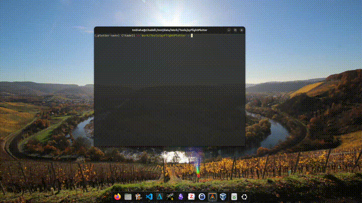

# pyFlightPlotter

[](https://pypi.org/project/pyFlightPlotter/)
[](https://pypi.org/project/pyFlightPlotter/)
[](https://github.com/tudelft/pyFlightPlotter/blob/main/LICENSE)

Interactive, configurable and three-dimensional flight data plotting, with little boilerplate.

Hover over a time-series plot and every connected window follows along: the cursor moves in sync in all
time-series axes, and a 3D viewport shows the vehicle's attitude, position, velocity, acceleration and
actuator state at that moment. You can also sync an onboard or external video to the log.



## Features

- **3D viewport** showing estimates, setpoints and measurements of
  - attitude (quaternions)
  - position, velocity and acceleration
  - rotor force commands
  - control surface deflections
- **Time-series plotting** in a configurable grid layout. `_plot_timeseries()` takes several line styles
  (light / solid / dashed / true value) and keeps colours consistent across series.
- **A synchronized vertical cursor** across all time-series axes, even when they're spread over several
  figures. The 3D viewport updates on mouse hover.
- **Playback**: press <kbd>Space</kbd> to play or pause the log in real time.
- **Video sync** (`VideoViewport`): show an MP4 next to the log, with an adjustable time offset.
- **Craft builder**: the `Craft3D` class has `addRotor` and `addSurface` methods to define a vehicle quickly.
  - single-axis surface tilt
  - dual-axis rotor tilt
  - presets included: `Quadrotor`, `Tailsitter`

## Installation

```sh
pip install pyFlightPlotter
```

With video support (`VideoViewport`, which needs OpenCV):

```sh
pip install "pyFlightPlotter[video]"
```

The latest development version from GitHub:

```sh
pip install "pyFlightPlotter @ git+https://github.com/tudelft/pyFlightPlotter"
```

Requires Python 3.10 or newer. The dependencies are `numpy`, `scipy` and `matplotlib`. You also need an
interactive matplotlib backend (e.g. QtAgg or TkAgg).

## Usage

You build a plotter by subclassing `FlightPlotterBase` and implementing `_populate()`, where you add the
subplots you want. `BlittedCursor` adds the synchronized cursor, and `connect_viewport()` links a 3D
`Viewport` (or a `VideoViewport`) to the mouse.

A minimal example ([`docs/examples/minimal_example.py`](https://github.com/tudelft/pyFlightPlotter/blob/main/docs/examples/minimal_example.py)):

```python
import numpy as np

from pyFlightPlotter import FlightPlotterBase, BlittedCursor, Viewport, Quadrotor

class FlightPlotterMinimalExample(FlightPlotterBase):
    def __init__(self, time, data):
        self.data = data
        super().__init__(time, name="MWE")
        self.define_layout(nrows=1, ncols=1)
        self.plot()

    def _populate(self):
        self._plot_timeseries(
            self.fig.add_subplot(self.gs[0, 0]),
            light=None,
            solid=[self.data[2], self.data[3]],
            dashed=[self.data[0], self.data[1]],
            series_labels=["Signal 1", "Signal 2"],
            style_labels=[None, "Estimated", "Setpoint"],
            title="Example Time Series",
            ylabel="Amplitude",
        )

if __name__ == "__main__":
    t = np.linspace(0, 2, 101)
    data = [
        np.sin(2*np.pi*0.5*t), np.sin(2*np.pi*0.5*t + 0.2),
        np.cos(2*np.pi*0.5*t + 0.4), np.cos(2*np.pi*0.5*t + 0.6),
    ]

    fp = FlightPlotterMinimalExample(t, data)
    bc = BlittedCursor(fp.all_axes, sharex=True)

    vp = Viewport(craft=Quadrotor(),
                  time=np.array([0., 1., 2.]),
                  att=np.array([[1., 0., 0., 0.], [0.7, 0., 0., 0.7], [0., 0., 0., 1.]]),
                  # ... many more data can be passed here, but attitude is required
                  interpolation="linear",
                  follow=False,
                  title="Viewport Example",
                  )

    # connect mouse hover
    fp.connect_viewport(vp)
```

Run it with `python -i` so the windows stay open.

For a full example with several figures, a tailsitter, and position/velocity/actuator data, see
[`docs/examples/complete_example.py`](https://github.com/tudelft/pyFlightPlotter/blob/main/docs/examples/complete_example.py).
For an example of hooking pyFlightPlotter into your own log-data structure, see
[indiflight](https://github.com/tudelft/indiflight/blob/global_rls/support/LogAnalysis/indiflightPlotter.py).

### Video synchronization

```python
from pyFlightPlotter import VideoViewport

vv = VideoViewport(time=t, mp4_path="flight.mp4", offset_s=0.0)
fp.connect_viewport(vv)
```

The video time is `data_time + offset`. You can set the offset with the slider or text box in the video
window, or step one frame at a time with the arrow keys. You can also load a file from inside the window.

### Controls

| Input | Action |
|---|---|
| Mouse hover over a time-series axis | Move the cursor; all connected viewports update |
| <kbd>Space</kbd> | Play / pause real-time playback |
| <kbd>←</kbd> / <kbd>→</kbd> (video window) | Shift the video offset by one frame |

### Conventions

Quaternions are scalar-first: `[w, x, y, z]`. Arrays are expected with time along the first axis, e.g.
`Nx4` for attitude and `Nx3` for position, velocity and acceleration. See the `Viewport` docstring for all
supported inputs.

## Browser version (`pyFlightPlotter.web`)

The same plots in the browser, drawn with [uPlot](https://github.com/leeoniya/uPlot) and three.js: fast enough
for long, high-rate logs, with a synchronized cursor and live values, zoom and pan, playback, a PSD of the visible
window per panel, PNG export, and a 3D view. Python supplies the signals, panels and 3D view; `show()` serves them
from a local server (127.0.0.1) and opens the browser.

```python
from pyFlightPlotter import Tailsitter
from pyFlightPlotter.web import WebPlotter

wp = WebPlotter(t, name="Demo")
wp.add_signals({"pos[0]": x, "pos[1]": y, "pos[2]": z})          # dict or pandas DataFrame
wp.add_panel("Position", solid=["pos[0]", "pos[1]", "pos[2]"],   # as _plot_timeseries
             series_labels=["X", "Y", "Z"], style_labels=[None, "Estimate", None], ylabel="[m]")
wp.set_viewport(Tailsitter(), att=quat_wxyz, pos=pos_xyz)         # as Viewport
wp.add_event(5.0, "takeoff")
wp.show()
```

Column references in panels and the viewport are names, `(name, scale)` tuples, or arrays. `add_signal(..., description="...")`
(or `data.descriptions` in JS) explains a signal, e.g. a derived one, in tooltips and the signal picker. A complete example is in
`docs/examples/web_example.py`.

The JS part is a standalone ES module package (`package.json` at the repository root, sources in
`pyFlightPlotter/web/static/flightplotter/`), usable without Python:

```js
import { FlightPlotter, Dataset, quadrotor } from "flightplotter";
import "flightplotter/style.css";
import "uplot/dist/uPlot.min.css";

const fp = new FlightPlotter(element, {
    data: { time, columns: { "pos[0]": Float32Array, ... }, events: [{ t, name, kind }] },
    panels: [{ title: "Position", ylabel: "[m]", styles: [null, "Estimate", null],
               series: [{ label: "X", solid: "pos[0]" }] }],
    viewport: { craft: quadrotor(), att: ["q0", "q1", "q2", "q3"], pos: ["pos[0]", "pos[1]", "pos[2]"] },
    editable: false,   // no editing, tabs only to switch, no layout import/export
    theme: "dark",
});
```

### Layouts, tabs and windows

The data goes in once; the panels and the 3D view can change afterwards. With `editable` (the default) you can:

- add plots and signals, edit a panel (✎ or double-click its title: titles, y range, line styles, series with
  `"name * scale"`), drag a panel by its header onto another (swap) or an empty cell (move), and remove it;
- organise panels in **tabs** (+ to add, double-click to rename, × to close). Each tab can show the 3D view or not
  (the **3D** button; on by default in the first tab only);
- pick the craft in the 3D view (from the host's `crafts` option) and set each rotor's spin and signals (**Rotors…**);
- **⧉** opens a tab in its own window, which follows the main window's cursor, zoom and playback and returns
  to the tab bar when closed. This needs a `popoutUrl`: a page that loads the library and calls `attachPopout()`
  (the page served from Python does this itself);
- export the layout as JSON, import one, or go back to the initial layout (**Layout ⤓ / ⤒ / ↺**).

The layout file holds no data, and column references that a log lacks are skipped, so one layout works across logs:

```json
{ "format": "flightplotter-layout", "version": 2,
  "tabs": [{ "name": "Attitude", "view": true,
             "panels": [{ "title": "Rates", "ylabel": "[rad/s]", "styles": [null, "Estimate", "Setpoint"],
                          "series": [{ "label": "roll", "solid": "gyro[0]", "dashed": ["gyroSp[0]", 1] }] }] }],
  "viewport": { "craft": { "body": [], "rotors": [], "surfaces": [] }, "att": ["q0", "q1", "q2", "q3"] } }
```

Version 1 files (`{ "panels": [...], "viewport": ... }`) still load, as one tab. From code: `fp.getLayout()`,
`fp.setLayout(layout)` (throws on a malformed layout, naming the entry), the `layout` option to start from a saved
layout, and `onLayoutChange(layout)` to persist the user's. In Python, `wp.add_tab("Name", view=False)` starts a tab
for the following `add_panel` calls, and `wp.set_layout("layout.json")` / `wp.layout()` read and write the same
format. A layout without a `"viewport"` key keeps the current 3D view; `"viewport": null` removes it.

It needs `uplot` and `three` resolvable by the bundler; the page served from Python uses the copies in
`pyFlightPlotter/web/static/vendor/` through an import map.

## Development

```sh
git clone https://github.com/tudelft/pyFlightPlotter
cd pyFlightPlotter
pip install -e ".[video]"
python -i docs/examples/complete_example.py
```

## License

GPL-3.0-or-later. See [LICENSE](https://github.com/tudelft/pyFlightPlotter/blob/main/LICENSE).
